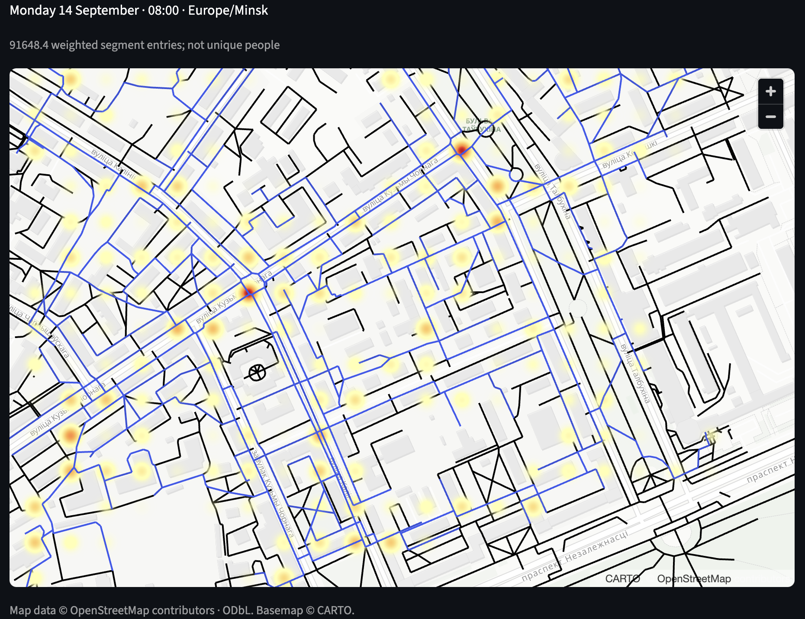

# UrbanFlow

An experimental pedestrian traffic simulator for a 1×1 km city area. UrbanFlow
imports OpenStreetMap data, creates a synthetic population, generates daily
activity plans and routes them through the pedestrian network.

The research question is whether LLM-generated plans predict relative pedestrian
traffic better than a gravity baseline. Predictive accuracy has not been established.



*Simulation replay in Minsk: pedestrian intensity and agent trajectories.*

## Quick start

With Docker and Docker Compose running:

```console
docker compose up --build -d --wait
```

Open [Streamlit](http://localhost:8501). The stack includes the UI, a
[FastAPI service](http://localhost:8000/docs) and PostgreSQL/PostGIS. Database
migrations run automatically on API startup.

1. **World explorer:** select a 1×1 km area and import OpenStreetMap data.
2. **Population:** configure archetypes and generate agents. Use at least as many
   agents as eligible residential buildings; the UI shows the minimum.
3. **Experiments:** run the baseline, then an LLM experiment with matching settings.
4. **Replay:** select a day/hour and display segment traffic, heatmap or trajectories.
5. **Validation:** enter pedestrian counts or import CSV, then compare both methods.

For a synthetic example without an LLM or OSM download:

```console
docker compose exec api urbanflow demo
```

## LLM configuration

Copy `.env.example` to `.env` and set the provider, endpoint and model. For OpenRouter:

```dotenv
LLM_PROVIDER=openai
LLM_BASE_URL=https://openrouter.ai/api/v1
LLM_API_KEY=your-private-key
LLM_MODEL=your-provider/your-model
```

For local models, leave the API key empty when the server needs no authentication:

| Server | `LLM_PROVIDER` | Example `LLM_BASE_URL` |
|---|---|---|
| OpenAI-compatible server | `openai` | `http://host.docker.internal:1234/v1` |
| Native Ollama | `ollama` | `http://host.docker.internal:11434` |

Set `LLM_MODEL` to the loaded model's identifier. `host.docker.internal` addresses
the host from Docker; use `localhost` when running the API on the host.
The selected model and endpoint must support JSON Schema structured output.
Apply changes with:

```console
docker compose up -d --force-recreate api
```

The planner uses AsyncOpenAI for compatible endpoints and an async HTTP adapter
for native Ollama. It receives the agent's persona and reachable map destinations,
then returns a validated daily plan. Routing and traffic calculations run in Python.

Defaults are four concurrent calls, a 90-second timeout and two retries. Truncated
responses retry with a larger token budget, starting at 8192 and capped at 32768.
The **LLM token budget** section in Experiments allows adjusting these limits.
Validated plans are cached in PostgreSQL; **Re-execute saved plans** makes no LLM calls.

## Data and logs

Imported worlds, populations, plans, traffic and observations persist in the
`urbanflow_postgres` Docker volume. `docker compose down` preserves it;
`docker compose down -v` deletes it.

```console
docker compose logs -f api
docker compose stop
```

For local database inspection: host `127.0.0.1`, port `5432` (or `POSTGRES_PORT`),
database/user `urbanflow`, empty password. Compose uses trust authentication and
binds published ports to loopback; this is a local development setup.

## Interpreting results

Traffic values count **weighted entries into street segments**, not unique people
or occupancy. Validation compares observed counts with simulated traversals over
matching intervals and reports MAE and Spearman correlation.

Population distributions and attraction weights are assumptions. OSM coverage
limits routing quality; building access uses nearest graph nodes. Opening hours
are passed to the planner but have no dedicated evaluator. The model does not
include outside-area commuters, public transport trips, weather or crowd interactions.
Real pedestrian counts are needed to assess prediction quality.

## Development

Python **3.14.2–3.14.x**, managed with uv:

```console
uv sync
uv run ruff check .
uv run pyright
uv run pytest
```

PostGIS integration tests require a separate `urbanflow_test` database. See
[verification](docs/verification.md) for commands and test coverage.
[Architecture](docs/architecture.md) describes the domain boundaries and data
semantics; [ADRs](docs/adr/) record the main design decisions.
