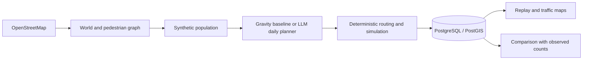

# Architecture

UrbanFlow executes small pedestrian experiments in one application process.
FastAPI and the CLI call application services; Streamlit consumes the API.

## Domain boundaries

| Module | Responsibility |
|---|---|
| `world` | Overpass ingestion, OSM objects, pedestrian infrastructure, completeness |
| `population` | Archetypes, weighted agents, home and work/study assignments |
| `behavior` | Provider-independent daily plans, LLM requests and validation |
| `routing` | Directed pedestrian graph, shortest paths and walking distances |
| `simulation` | Clock, configuration, seeded inputs, trips and edge traversals |
| `analytics` | Gravity baseline, segment/hour totals and spatial aggregation |
| `validation` | Observations, baseline/LLM comparisons, MAE and Spearman |
| `storage` | SQLAlchemy repositories, PostGIS persistence and LLM cache |
| `services.py` | Application orchestration and result persistence |
| `api`, `ui` | HTTP and visualization boundaries |

## Planning and execution

Each planning context contains one agent, a date, a seed, the home and every POI
reachable for a round trip. Candidate walking times are measured from home.
The LLM chooses up to ten non-home visits and a return-home departure time.
UrbanFlow inserts the home boundaries and validates destination IDs and chronology.
The [behavior ADR](adr/002-behavior-engine.md) defines the provider contract.

Routing uses shortest distance on the directed OSM graph. Objects connect to their
nearest node within 150 m; these straight access legs affect travel time but are
not counted as street traffic. A departure waits for the previous trip to finish.
Trips that cannot finish before midnight fail. Runs crossing a daylight-saving
change are rejected.

Runs have explicit running/completed/failed status. Results commit atomically;
validated LLM cache entries commit independently and survive a later run failure.
Restart recovery marks abandoned runs failed. Use a single API worker.

## Persistence and reproducibility

PostgreSQL/PostGIS stores world snapshots, city objects, graph nodes/edges,
populations, plans, trips, traversals, aggregates, observations and comparisons.
Buildings, POIs and entrances are typed views over `city_object`. JSON holds source
tags, configuration and provider envelopes; geometry uses WGS84/SRID 4326.

Runs record their world/population, configuration, seed, provider/model, prompt
version, simulation interval and application package version. Cached plans are revalidated.
Saved plans can be executed again without a provider; fresh LLM generation is not
promised deterministic. Operational JSON logs go to container output.

## Traffic and validation semantics

Segment totals sum agent weights at traversal entry times. Both travel directions
share the physical edge ID. Hour bins and observation windows are half-open
intervals `[start, end)`; partial-hour observations use raw traversal times.
The heatmap sums segment entries into 50 m cells at segment midpoints.

Observations represent counts on an edge in both directions. Validation requires
matching world, population and simulation settings for baseline and LLM runs.
MAE and Spearman are stored with paired values; Spearman is null when there are
insufficient pairs or constant ranks. These metrics need real observations to
support any claim about predictive accuracy.
